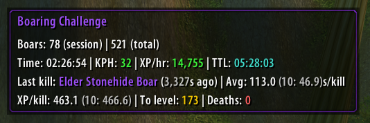
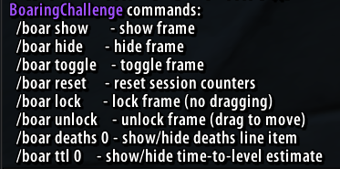

# 🐗 BoaringChallenge

A lightweight Vanilla/Turtle WoW addon designed for the **Boaring Adventure Challenge** - track your progress as you level exclusively by killing boars!

Perfect for the ultimate grind when you just want to know:

- How many boars have I killed?
- How fast am I killing?
- How much XP per hour?
- How many more boars until next level?

---

## 🎯 Boaring Adventure Challenge

This addon is specifically designed for characters with the **Boaring Adventure** challenge, where you can only gain experience by killing boars, goretusks, and swine.

**Smart Detection:**
- Automatically detects if your character is on the Boaring Adventure challenge
- Only activates for challenge characters (zero overhead for non-challenge characters)
- Character-specific tracking - each character maintains their own statistics

---

## ✨ Features

**Tracking:**
- Character-specific session + lifetime boar kill tracking
- Kills per hour (KPH)
- XP per hour (boar-only XP)
- Average seconds per kill
- Rolling average of last 10 kills
- XP per kill (session + last 10)
- Estimated boars remaining until next level
- Optional time-to-level estimate (TTL)
- Optional death counter

**Quality of Life:**
- Automatic character recreation detection (perfect for Hardcore deaths)
- Manual reset option for total kills
- Draggable + lockable UI
- Multi-language support:
  - English
  - French
  - Spanish
  - German
  - Simplified Chinese
  - Korean

---

## Screenshots





---

## 🎮 Supported Clients

Designed for:

- Vanilla 1.12
- Turtle WoW

Lua 5.0 compatible.

---

## 📦 Installation

1. Download or clone this repository
2. Place the `BoaringChallenge` folder into: `World of Warcraft/Interface/AddOns/`
3. Launch the game
4. Enable the addon in the AddOns menu
5. Log in with a character that has the **Boaring Adventure** challenge

The addon will automatically detect the challenge and activate! Type `/boar` to see available commands. 

## 🛠 Commands

```
/boar show              - Show the tracker frame
/boar hide              - Hide the tracker frame
/boar toggle            - Toggle frame visibility
/boar reset             - Reset session counters
/boar resettotal        - Reset total kills to 0 (for character recreation)
/boar lock              - Lock frame (prevent dragging)
/boar unlock            - Unlock frame (allow dragging)
/boar deaths 0|1        - Show/hide death counter
/boar ttl 0|1           - Show/hide time-to-level estimate
```

**Tip:** Right-click the frame to quickly toggle lock/unlock.

---

## 🌍 Localization Notes

The addon UI is localized.

⚠ Combat log parsing assumes English combat messages by default.
If your server localizes combat log text, XP parsing patterns may need adjustment in `Locale` files.

---

## 📈 How It Works

**XP Tracking:**
XP is counted **only when linked to a tracked boar kill** (within 3 seconds), ensuring:
- Quest XP is ignored
- Exploration XP is ignored
- Non-boar XP is ignored

This keeps metrics accurate for pure grinding sessions.

**Character Recreation Detection:**
The addon automatically detects if you've deleted and recreated your character (perfect for Hardcore deaths):
- Tracks your character level
- If current level < stored level → auto-resets all data
- Manual reset available via `/boar resettotal` for edge cases

**Challenge Detection:**
On character login, the addon checks your spellbook for the "Boaring Adventure" spell:
- Spell found → Addon activates and tracks your progress
- Spell not found → Addon stays dormant (zero overhead)

---

## 🚀 Future Ideas

- Gold per hour tracking
- Session persistence across reload
- Streak tracking
- Export statistics to CSV/text

---

## 📜 License

MIT License

---

Enjoy the grind.